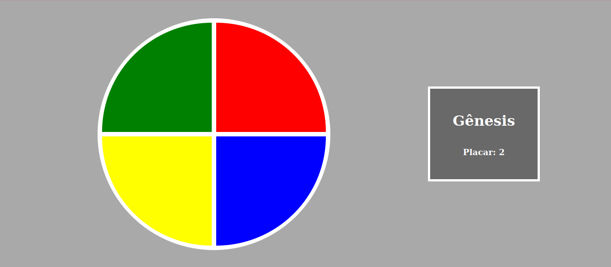

#  Criando um jogo de memória estilo Genius :video_game:

Este projeto apresenta uma criação do jogo Gênesis utilizando apenas HTML, CSS e Javascript de forma introdutória, sendo o principal conceito, CSS Grid, manipulação de Array e Arrow Functions. Este é um desafio de projeto da Digital Innovation One.

## :gear: Tecnologias

- HTML5
- CSS3
- JavaScript

## :art: Layout

